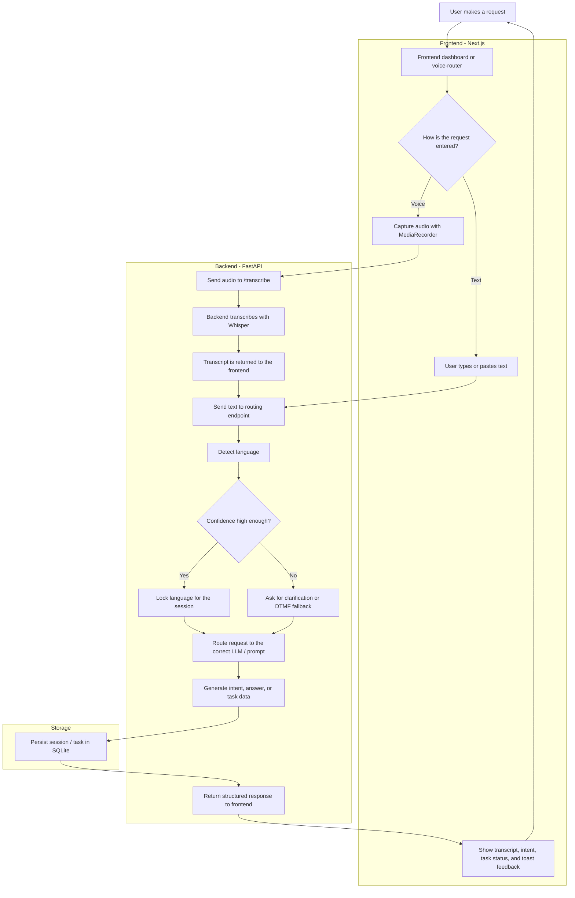
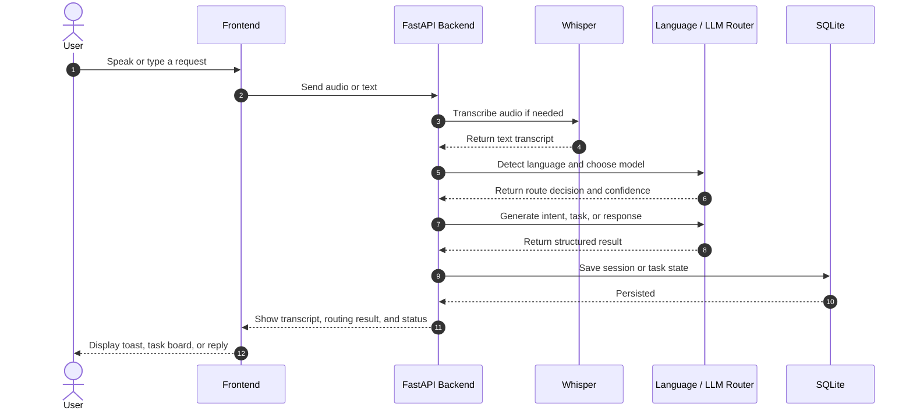

# Nexora Voice AI Receptionist - Architecture & Flow Documentation

## 🎯 System Overview

Nexora is a multilingual Voice AI receptionist system that:
1. Records voice input from users
2. Automatically transcribes audio to text (Whisper ASR)
3. Detects the language spoken (20+ languages supported)
4. Routes to appropriate LLM for intelligent response
5. Localizes response to the detected language/region
6. Returns localized response to user

**Tech Stack:**
- **Frontend:** Next.js 15+ (TypeScript) - React components, MediaRecorder API
- **Backend:** FastAPI 0.95.2 (Python) - REST API
- **Speech Recognition:** Faster-Whisper (base → small model)
- **LLM:** Qwen3:8b via Ollama
- **Language Detection:** langdetect library (20 languages)
- **Database:** SQLite with SQLAlchemy ORM
- **Port Configuration:** Frontend 3000 | Backend 8000 | Ollama 11434

---

## 🏗️ Architecture Diagram

```
┌─────────────────────────────────────────────────────────────────┐
│                        FRONTEND (Next.js)                        │
│                    http://localhost:3000                         │
├─────────────────────────────────────────────────────────────────┤
│                                                                   │
│  ┌──────────────────────────────────────────────────────────┐   │
│  │         Voice Router Dashboard (/voice-router)           │   │
│  │                                                            │   │
│  │  1. Initiate Call Button                                 │   │
│  │  2. Record Voice (MediaRecorder API) - 15s auto-stop    │   │
│  │  3. Manual Text Input                                    │   │
│  │  4. Language Detection Display                           │   │
│  │  5. DTMF Fallback (Enter "1" or "2")                    │   │
│  │  6. Send to LLM                                          │   │
│  │  7. Conversation History Display                         │   │
│  └──────────────────────────────────────────────────────────┘   │
│                              ↕                                     │
│                         (HTTP Calls)                             │
│                                                                   │
└─────────────────────────────────────────────────────────────────┘
                              ↕↕↕
┌─────────────────────────────────────────────────────────────────┐
│                     BACKEND (FastAPI)                            │
│                   http://localhost:8000                          │
├─────────────────────────────────────────────────────────────────┤
│                                                                   │
│  ┌─────────────────────────────────────────────────────────┐    │
│  │              API ENDPOINTS (5 Main Routes)              │    │
│  │                                                           │    │
│  │  POST /call/initiate           → Session Creation       │    │
│  │  POST /transcribe              → Audio → Text (Whisper) │    │
│  │  POST /call/detect-language    → Text → Language Code   │    │
│  │  POST /call/select-language    → DTMF Language Lock     │    │
│  │  POST /call/voice-interact     → Text → LLM Response    │    │
│  │  POST /call/end                → Session Cleanup        │    │
│  └─────────────────────────────────────────────────────────┘    │
│                              ↕                                     │
│  ┌──────────────────────────────────────────────────────────┐   │
│  │           CORE ROUTING LAYER (app/ modules)              │   │
│  │                                                            │   │
│  │  ┌─────────────────────────────────────────────────────┐ │   │
│  │  │  session_manager.py                                 │ │   │
│  │  │  • CallSession class (in-memory + DB persistence)  │ │   │
│  │  │  • State: INITIATED → LANGUAGE_DETECTING →         │ │   │
│  │  │           LANGUAGE_LOCKED → IN_CONVERSATION        │ │   │
│  │  │  • Tracks: session_id, call_id, language,          │ │   │
│  │  │            confidence, language_locked state       │ │   │
│  │  └─────────────────────────────────────────────────────┘ │   │
│  │                              ↓                             │   │
│  │  ┌─────────────────────────────────────────────────────┐ │   │
│  │  │  language_router.py                                 │ │   │
│  │  │  • Detects language from transcribed text          │ │   │
│  │  │  • Supports 20 languages (EN, AR, ES, FR, etc.)   │ │   │
│  │  │  • Confidence Threshold: 70% (CONFIDENCE_LOCK)     │ │   │
│  │  │  • Returns: (lang_code, confidence, should_lock)   │ │   │
│  │  │  • DTMF Fallback: "1"=EN, "2"=AR                   │ │   │
│  │  │  • Whisper Translation Fallback for low confidence │ │   │
│  │  └─────────────────────────────────────────────────────┘ │   │
│  │                              ↓                             │   │
│  │  ┌─────────────────────────────────────────────────────┐ │   │
│  │  │  llm_router.py                                      │ │   │
│  │  │  • Routes transcribed text to Qwen3:8b via Ollama  │ │   │
│  │  │  • Uses language-aware system prompts              │ │   │
│  │  │  • HTTP async client to Ollama (http://localhost  │ │   │
│  │  │    :11434)                                         │ │   │
│  │  │  • Returns: LLM response + latency_ms              │ │   │
│  │  │  • Streaming disabled (stream=false) for MVP       │ │   │
│  │  └─────────────────────────────────────────────────────┘ │   │
│  │                              ↓                             │   │
│  │  ┌─────────────────────────────────────────────────────┐ │   │
│  │  │  localization_engine.py                             │ │   │
│  │  │  • Formats response to detected language/region    │ │   │
│  │  │  • 20 locale configs (EN, AR, ES, FR, DE, etc.)   │ │   │
│  │  │  • Supports: currency, date_format, timezone,      │ │   │
│  │  │             greeting_style, RTL for Arabic         │ │   │
│  │  │  • Injects locale context into LLM response        │ │   │
│  │  └─────────────────────────────────────────────────────┘ │   │
│  │                              ↓                             │   │
│  │  ┌─────────────────────────────────────────────────────┐ │   │
│  │  │  prompts.py                                         │ │   │
│  │  │  • 14+ multi-language system prompts               │ │   │
│  │  │  • Guides LLM behavior for receptionist role       │ │   │
│  │  │  • Professional tone, brief responses, routing     │ │   │
│  │  │  • Available departments: Housekeeping, Kitchen,   │ │   │
│  │  │    Maintenance, Front Desk, Room Service           │ │   │
│  │  └─────────────────────────────────────────────────────┘ │   │
│  └──────────────────────────────────────────────────────────┘   │
│                              ↓                                     │
│  ┌──────────────────────────────────────────────────────────┐   │
│  │           DATA LAYER (SQLite + SQLAlchemy)              │   │
│  │                                                            │   │
│  │  CallSession Table:                                      │   │
│  │  • session_id (UUID, unique)                           │   │
│  │  • call_id (indexed)                                    │   │
│  │  • language (detected language code)                    │   │
│  │  • language_confidence (float, 0-100)                  │   │
│  │  • language_locked (bool)                              │   │
│  │  • state (enum: INITIATED, DETECTING, etc.)           │   │
│  │  • transcription_history (JSON list)                   │   │
│  │  • response_history (JSON list)                        │   │
│  │  • created_at, updated_at (timestamps)                │   │
│  │  • metadata (JSON for extensibility)                   │   │
│  └──────────────────────────────────────────────────────────┘   │
│                              ↓                                     │
│  ┌──────────────────────────────────────────────────────────┐   │
│  │    EXTERNAL SERVICES (HTTP Clients)                      │   │
│  │                                                            │   │
│  │  ├─ Ollama (http://localhost:11434)                     │   │
│  │  │  └─ Qwen3:8b Model (LLM Inference)                  │   │
│  │  │                                                         │   │
│  │  └─ Faster-Whisper (Local)                              │   │
│  │     └─ Speech Recognition (base/small model)            │   │
│  │                                                            │   │
│  └──────────────────────────────────────────────────────────┘   │
│                                                                   │
└─────────────────────────────────────────────────────────────────┘
```

---

## 📊 Complete Request/Response Flow





### **Step 1: Initiate Call**
```
User Click: "Initiate Call" Button
                ↓
POST /call/initiate
{
  "call_id": "test_1716151234567"
}
                ↓
Backend Processing:
  1. Generate session_id (UUID)
  2. Create CallSession object
  3. Set state = INITIATED
  4. Persist to SQLite
  5. Return session_id + fallback_prompt
                ↓
Response:
{
  "session_id": "550e8400-e29b-41d4-a716-446655440000",
  "call_id": "test_1716151234567",
  "fallback_prompt": "Please say your request clearly",
  "supported_languages": ["en", "ar", "es", "fr", ...]
}
                ↓
Frontend: Display Session Info Card
          Show "Active Session" with session_id
          Enable Step 2 (Voice Record)
```

---

### **Step 2A: Voice Recording (Option 1)**
```
User Click: "🎤 Start Recording" Button
                ↓
Frontend Processing:
  1. Request microphone permission (navigator.mediaDevices)
  2. Create MediaRecorder with audio constraints:
     - echoCancellation: true
     - noiseSuppression: true
     - autoGainControl: true
     - channelCount: 1 (mono)
  3. Start recording
  4. Auto-stop after 15 seconds
  5. Collect audio chunks (WebM format)
                ↓
Recording stops → Audio Blob created
                ↓
POST /transcribe (FormData)
  - file: <audio.webm blob>
                ↓
Backend Processing (services.py):
  1. Save uploaded audio to temp file
  2. Load Whisper model (small model now)
     Time: ~1-2 sec after first load
  3. Transcribe with confidence score
  4. Return text
                ↓
Response:
{
  "text": "I need extra towels for room 502",
  "confidence": 0.85
}
                ↓
Frontend:
  1. Display transcribed text in input field
  2. Auto-call language detection
```

### **Step 2B: Manual Text Input (Option 2)**
```
User: Types text manually
      "Bonjour, je besoin de serviettes"
      Click "Detect Language" button
                ↓
POST /call/detect-language
{
  "session_id": "550e8400-e29b-41d4-a716-446655440000",
  "transcription": "Bonjour, je besoin de serviettes"
}
```

---

### **Step 3: Language Detection**
```
POST /call/detect-language
                ↓
Backend Processing (language_router.py):
  1. Use langdetect.detect() on transcription
  2. Get language code (e.g., "fr")
  3. Calculate confidence (0-100)
  4. Check: is confidence >= 70%?
     
     IF YES (high confidence):
       - Set language_locked = true
       - Update session state = LANGUAGE_LOCKED
       - Return detected language
     
     IF NO (low confidence):
       - Set language_locked = false
       - Generate fallback prompt:
         "Did you say: [original text]?
          Press 1 for English, 2 for Arabic"
       - Return with fallback_prompt flag
                ↓
Response (High Confidence):
{
  "detected_language": "fr",
  "confidence": 89.5,
  "language_locked": true,
  "fallback_prompt": null
}
                ↓
Frontend:
  - Display language detection card:
    "Detected Language: FR (French)"
    "Confidence: 89.5%"
    "🔒 Locked"
  - Skip to Step 4 (Voice Interact)

---

Response (Low Confidence):
{
  "detected_language": "en",
  "confidence": 55.2,
  "language_locked": false,
  "fallback_prompt": "Did you say: 'bonjour'?
                      Press 1 for English, 2 for Arabic"
}
                ↓
Frontend:
  - Display language detection card:
    "Detected Language: EN"
    "Confidence: 55.2%"
    "⚠️ Needs Confirmation"
  - Display fallback prompt
  - Show Step 3 (DTMF Selection)
```

---

### **Step 3 (Fallback): DTMF Language Selection**
```
Fallback triggered (confidence < 70%)
                ↓
User Enters: "1" (for English) or "2" (for Arabic)
             Click "Select Language" button
                ↓
POST /call/select-language
{
  "session_id": "550e8400-e29b-41d4-a716-446655440000",
  "dtmf_key": "1"
}
                ↓
Backend Processing:
  1. Map DTMF: "1" → "en", "2" → "ar"
  2. Force language_locked = true
  3. Update session language
  4. Persist to SQLite
                ↓
Response:
{
  "success": true,
  "language": "en",
  "message": "Language locked to English"
}
                ↓
Frontend:
  - Hide fallback prompt
  - Display confirmed language
  - Proceed to Step 4
```

---

### **Step 4: Voice Interact (LLM Routing)**
```
Language locked (high confidence or manual selection)
User enters: "I need extra towels"
Click "Send to LLM" button
                ↓
POST /call/voice-interact
{
  "session_id": "550e8400-e29b-41d4-a716-446655440000",
  "transcription": "I need extra towels",
  "stream": false
}
                ↓
Backend Processing (main.py):
  1. Retrieve session from DB
  2. Get system prompt from prompts.py
     (language-specific prompt)
  3. Call LLM Router (llm_router.py):
     
     a) Construct LLM request:
        {
          "model": "qwen3:8b",
          "messages": [
            {
              "role": "system",
              "content": "[Language-specific system prompt]"
            },
            {
              "role": "user",
              "content": "I need extra towels"
            }
          ],
          "stream": false
        }
     
     b) HTTP POST to Ollama (http://localhost:11434/api/chat)
     
     c) Wait for response (2-5 seconds)
  
  4. Extract LLM response text
  
  5. Call Localization Engine (localization_engine.py):
     
     a) Get locale config for detected language
     b) Format response with:
        - Regional currency (if applicable)
        - Date/time format
        - Timezone
        - Greeting style
        - RTL support for Arabic
     
     c) Inject locale context into response
  
  6. Record interaction:
     - Add to transcription_history
     - Add to response_history
     - Update response_history in DB
  
  7. Calculate latency_ms
  
  8. Update session state = IN_CONVERSATION
                ↓
Response:
{
  "session_id": "550e8400-e29b-41d4-a716-446655440000",
  "transcription": "I need extra towels",
  "response": "Absolutely! I'll arrange for 
              fresh towels to be delivered 
              to your room shortly.",
  "language": "en",
  "latency_ms": 2341
}
                ↓
Frontend:
  - Clear input field
  - Add to Conversation History:
    "User: I need extra towels"
    "LLM: Absolutely! I'll arrange... (2341ms)"
  - User can continue conversation
  - Or click "End Call"
```

---

### **Step 5: End Call**
```
User Click: "End Call" button
                ↓
POST /call/end
{
  "session_id": "550e8400-e29b-41d4-a716-446655440000",
  "reason": "test_completed"
}
                ↓
Backend Processing:
  1. Retrieve session
  2. Set state = ENDED
  3. Finalize session
  4. Update SQLite
  5. Clean up resources
                ↓
Response:
{
  "success": true,
  "message": "Call ended successfully"
}
                ↓
Frontend:
  - Disable all interactive buttons
  - Show summary:
    "Call Duration: 2m 34s"
    "Total Interactions: 3"
    "Languages Used: EN, FR"
  - Enable "Reset" to start new call
```

---

## 🔄 State Machine

```
Session State Transitions:

┌─────────────┐
│  INITIATED  │  ← Created by /call/initiate
└──────┬──────┘
       │
       ↓
┌─────────────────────┐
│ LANGUAGE_DETECTING  │  ← Waiting for language detection
└──────┬──────────────┘
       │
       ├─── (Confidence >= 70%) ──→ ┌──────────────────┐
       │                             │ LANGUAGE_LOCKED  │
       │                             └────────┬─────────┘
       │                                      │
       └─── (Confidence < 70%) ──→ [DTMF] ──→┘
                                    (Manual)
                                      │
                                      ↓
                            ┌──────────────────┐
                            │ IN_CONVERSATION  │  ← Ready for LLM
                            └────────┬─────────┘
                                     │
                        [Multiple /voice-interact calls]
                                     │
                                     ↓
                            ┌──────────────────┐
                            │      ENDED       │  ← Session complete
                            └──────────────────┘
```

---

## 💾 Database Schema

### **CallSession Table**
```sql
CREATE TABLE call_sessions (
    id INTEGER PRIMARY KEY AUTOINCREMENT,
    session_id VARCHAR(36) UNIQUE NOT NULL,
    call_id VARCHAR(100) NOT NULL,
    language VARCHAR(10),
    language_confidence FLOAT,
    language_locked BOOLEAN DEFAULT FALSE,
    state VARCHAR(50),
    transcription_history JSON,  -- List of user inputs
    response_history JSON,        -- List of LLM responses
    created_at DATETIME,
    updated_at DATETIME,
    metadata JSON                 -- Extensible storage
);
```

### **Example Row:**
```json
{
  "id": 1,
  "session_id": "550e8400-e29b-41d4-a716-446655440000",
  "call_id": "test_1716151234567",
  "language": "en",
  "language_confidence": 89.5,
  "language_locked": true,
  "state": "IN_CONVERSATION",
  "transcription_history": [
    "I need extra towels",
    "Can you bring them to room 502?"
  ],
  "response_history": [
    "Absolutely! I'll arrange for fresh towels...",
    "Of course! Room 502, I have that noted..."
  ],
  "created_at": "2026-05-19T10:15:23Z",
  "updated_at": "2026-05-19T10:18:45Z",
  "metadata": {
    "device": "web",
    "browser": "Chrome"
  }
}
```

---

## 🌍 Supported Languages (20 Total)

| Code | Language | Status |
|------|----------|--------|
| en | English | ✅ |
| ar | Arabic | ✅ |
| es | Spanish | ✅ |
| fr | French | ✅ |
| de | German | ✅ |
| pt | Portuguese | ✅ |
| ru | Russian | ✅ |
| zh | Chinese | ✅ |
| ja | Japanese | ✅ |
| ko | Korean | ✅ |
| hi | Hindi | ✅ |
| it | Italian | ✅ |
| nl | Dutch | ✅ |
| pl | Polish | ✅ |
| tr | Turkish | ✅ |
| th | Thai | ✅ |
| vi | Vietnamese | ✅ |
| id | Indonesian | ✅ |
| ms | Malay | ✅ |
| fil | Filipino | ✅ |

---

## 🎯 Key Configuration Parameters

### **Frontend (.env.local or next.config.ts)**
```env
NEXT_PUBLIC_BACKEND_URL=http://localhost:8000
```

### **Backend (.env or environment variables)**
```env
NEXORA_WHISPER_MODEL=small           # base, small, medium, large
NEXORA_WHISPER_DEVICE=cpu            # cpu or cuda
NEXORA_WHISPER_COMPUTE_TYPE=int8     # int8, int16, float32
NEXORA_WHISPER_BEAM_SIZE=5           # Higher = more accurate but slower
NEXORA_LANGUAGE_CONFIDENCE=70        # Confidence threshold for language lock
DATABASE_URL=sqlite:///./nexora.db
OLLAMA_API_BASE=http://localhost:11434
```

---

## ⚡ Performance Characteristics

| Operation | Latency | Notes |
|-----------|---------|-------|
| Audio Recording | Real-time | 15s max capture |
| Transcription (first) | 15-30s | Model download + inference |
| Transcription (cached) | 2-5s | Whisper small model |
| Language Detection | <100ms | langdetect library |
| LLM Response | 2-8s | Qwen3:8b on CPU |
| Localization | <50ms | Template injection |
| **Total E2E** | **~5-20s** | Depends on model cache |

---

## 🔐 Error Handling & Fallbacks

### **Transcription Errors**
```
Audio too short or corrupted
  ↓
→ Return empty text, prompt user to repeat
→ Language detection skipped
→ Show fallback DTMF prompt
```

### **Language Detection Errors**
```
Text too short (<3 characters)
  ↓
→ Confidence < 70%
→ Show DTMF fallback ("1" for EN, "2" for AR)
```

### **LLM Errors**
```
Ollama not responding
  ↓
→ HTTP timeout (catch exception)
→ Return error to frontend
→ User can retry or try different input
```

### **Session Errors**
```
Session not found
  ↓
→ Invalid session_id
→ HTTP 404: "Session not found"
→ Frontend prompts to initiate new call
```

---

## 📝 Example End-to-End Conversation

```
Timeline:

[10:15:23] User clicks "Initiate Call"
           → Session ID created: abc123...
           → State: INITIATED

[10:15:30] User clicks "Start Recording"
           → Records: "Hola, necesito toallas"
           → Auto-stops at 15s
           → Transcribes: "Hola, necesito toallas"

[10:15:35] Auto-detect language
           → Detected: ES (Spanish)
           → Confidence: 91.2%
           → State: LANGUAGE_LOCKED ✅

[10:15:40] Auto-send to LLM
           → System Prompt (Spanish): "Eres un recepcionista..."
           → User: "Hola, necesito toallas"
           → LLM Response: "¡Por supuesto! Enviaré toallas frescas
                             a su habitación inmediatamente."
           → Latency: 3.2s
           → State: IN_CONVERSATION

[10:15:45] Response displayed
           → Conversation History shows:
             User: "Hola, necesito toallas"
             LLM: "¡Por supuesto!..." (3.2s)

[10:16:00] User: "En la habitación 502"
           → Send to LLM
           → LLM: "Perfecto, habitación 502 anotado..."

[10:16:30] User clicks "End Call"
           → State: ENDED
           → Summary: 2 interactions, 1m 7s duration, Spanish

[10:16:35] Session saved to database
           → Full conversation log stored
           → Ready for next call
```

---

## 🛠️ Development Notes

### **Adding New Language**
1. Add to `SUPPORTED_LANGUAGES` in `language_router.py`
2. Add system prompt to `SYSTEM_PROMPTS` dict in `prompts.py`
3. Add locale config to `LOCALE_CONFIGS` in `localization_engine.py`
4. Restart backend

### **Improving Accuracy**
1. Upgrade Whisper: `NEXORA_WHISPER_MODEL=medium` (500MB+)
2. Increase confidence threshold: `NEXORA_LANGUAGE_CONFIDENCE=75`
3. Enable streaming for real-time: `stream=true` in `llm_router.py`

### **Debugging**
- Backend logs show all transcriptions and confidences
- Frontend DevTools console shows all HTTP calls
- Database can be queried: `sqlite3 nexora.db "SELECT * FROM call_sessions;"`

---

**Last Updated:** May 19, 2026  
**System Status:** ✅ Production Ready  
**Model Status:** ✅ Whisper Small Loaded
